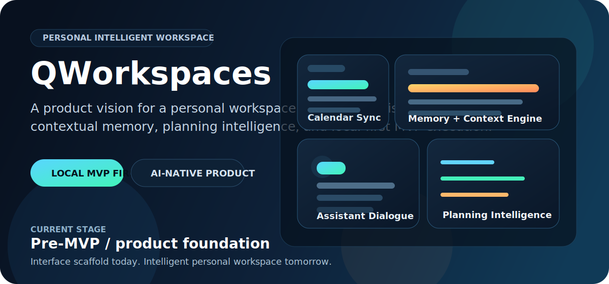
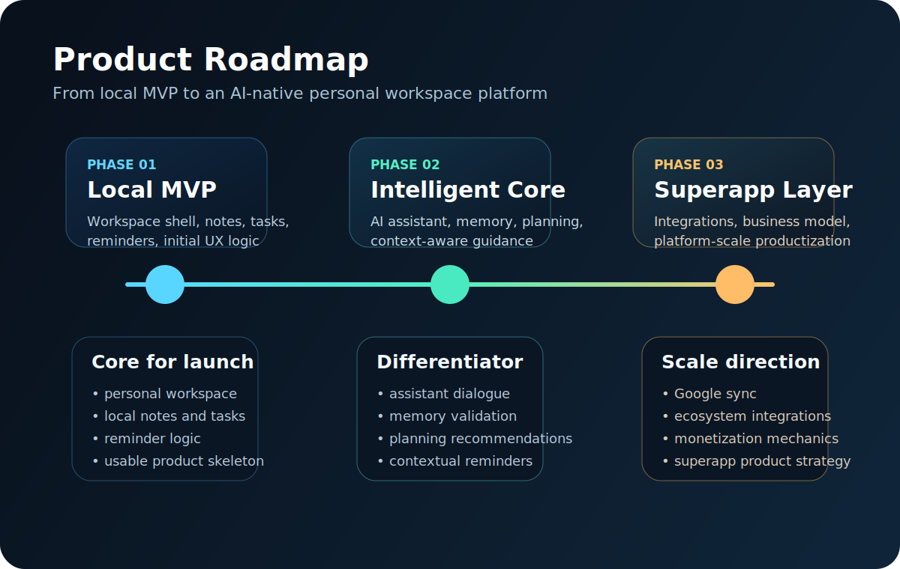

<p align="center">
  
</p>

<h1 align="center">QWorkspaces</h1>

<p align="center">
  <strong>Платформа персонального интеллектуального рабочего пространства</strong><br/>
  Ранний продуктовый фундамент для local-first среды с планированием, памятью, напоминаниями и личным ИИ-ассистентом.
</p>

## Общее описание

QWorkspaces задумывается как персональное цифровое рабочее пространство, а не как очередной менеджер задач. Продуктовая идея состоит в том, чтобы дать пользователю единую среду для планирования, задач, заметок, напоминаний, календарной координации и постоянного ИИ-ассистента, способного работать с контекстом, а не только отвечать на отдельные запросы.

Сейчас проект движется к MVP и находится на ранней стадии реализации. В текущем коде уже есть начальная структура приложения на Flet, приветственный экран и первые элементы логики навигации. Это еще не готовый продукт, а первый слой гораздо более широкой продуктовой системы.

## Продуктовое видение

Стратегическая цель проекта - создать среду, в которой пользователь работает не с набором разрозненных инструментов, а внутри единой персональной системы.

Целевой пользовательский опыт включает:
- личное пространство для ежедневного планирования и выполнения задач;
- заметки, задачи и напоминания, объединенные в одном контексте;
- календарное планирование с будущей синхронизацией с Google Calendar;
- личного ИИ-ассистента, который помогает определить, что делать, когда это делать и почему;
- контекстную память, сохраняющую важные детали и периодически уточняющую их актуальность через диалог.

QWorkspaces делает ставку на интеллект, непрерывность взаимодействия и контекст. Амбиция проекта заключается не в хранении списка задач, а в создании среды, которая помогает человеку мыслить, планировать и удерживать фокус на приоритетах.

## Текущее состояние

На текущем этапе проект включает:
- базовую структуру приложения на Flet;
- приветственный экран с начальной frontend-логикой;
- элементарную маршрутизацию между экранами;
- стартовый каркас персонального пользовательского пространства.

Текущую реализацию следует воспринимать как продуктовый фундамент. Ее основная ценность сегодня заключается в направлении, рамке продукта и подготовке архитектуры, а не в глубине функциональности.

## Визуальный вектор

<p align="center">
  
</p>

## Границы MVP

Первый рубеж - сильная локальная версия, которая подтверждает базовый пользовательский сценарий и формирует убедительную основу для дальнейшего роста.

Ближайший MVP должен включать:
- личное рабочее пространство пользователя;
- основу заметок и задач;
- базовую логику напоминаний;
- первичную структуру рабочего окружения;
- архитектурную подготовку под будущий слой ИИ-ассистента.

Local-first этап важен стратегически: он позволяет проверить повседневные пользовательские сценарии, логику взаимодействия и саму модель рабочего пространства до выхода в более широкую платформенную фазу.

## Стратегическое развитие

После локального MVP QWorkspaces должен развиваться в более широкую продуктовую систему, включающую:
- синхронизацию с Google Calendar;
- связанные между собой задачи, заметки и напоминания;
- ИИ-ассистента, способного обсуждать решения по планированию;
- персональную память, сохраняющую и обновляющую пользовательский контекст;
- движение в сторону супераппа с дифференцированной бизнес-моделью.

Практически это означает переход от базовой интерфейсной оболочки к AI-native уровню персональной продуктивности.

## Почему это не просто todo

Классические todo-приложения хорошо справляются с хранением пунктов списка. QWorkspaces должен идти дальше, объединяя исполнительные инструменты с контекстной интеллектуальной логикой.

Ключевые отличия продукта:
- память о пользовательском контексте вместо работы с изолированными запросами;
- рекомендации вместо пассивного хранения информации;
- напоминания, связанные с приоритетами и диалогом;
- рабочий процесс, который выстраивается не только через списки, но и через взаимодействие с ассистентом.

## Технологическая основа

- Python
- Flet

## Структура репозитория

```text
QWorkspaces/
|-- assets/
|   `-- readme/
|       |-- hero.svg
|       `-- roadmap.svg
|-- src/
|   |-- main.py
|   `-- screens/
|       |-- __init__.py
|       |-- hello.py
|       `-- home.py
|-- requirements.txt
|-- .gitignore
`-- README.md
```

## Локальный запуск

1. Создать и активировать виртуальное окружение.
2. Установить зависимости:

```bash
pip install -r requirements.txt
```

3. Запустить приложение:

```bash
python src/main.py
```

## Статус проекта

QWorkspaces сейчас находится на стадии pre-MVP. Кодовая база пока ранняя, но сама продуктовая гипотеза изначально строится как масштабная и долгосрочная.

## Git и безопасность

Репозиторий настроен так, чтобы в коммиты не попадали локальные и чувствительные артефакты, включая:
- виртуальные окружения;
- локальные `.env`-файлы;
- кэши и артефакты сборки;
- служебные данные IDE;
- типовые файлы сертификатов, ключей и локальных сервисных данных.

## Ближайший фокус

Ближайшая задача - превратить текущий фундамент в дисциплинированный локальный MVP, который можно будет рассматривать как реальную продуктовую базу, а не как набор экспериментов.
